# 本地到服务器配置变更可视化指南

**文档版本**: v1.0  
**创建日期**: 2025-12-19  
**最后更新**: 2025-12-19  
**目标读者**: 零基础小白，快速理解配置变更逻辑

---

## 🎯 核心问题：什么需要改？

### 一句话总结

**代码不需要改，配置必须改！**

- ✅ **代码**：路由、API调用、静态文件引用 → **不需要改**
- ⚠️ **配置**：环境变量、数据库、域名、OAuth → **必须改**

---

## 📊 整体流程图

### 1. 部署流程概览

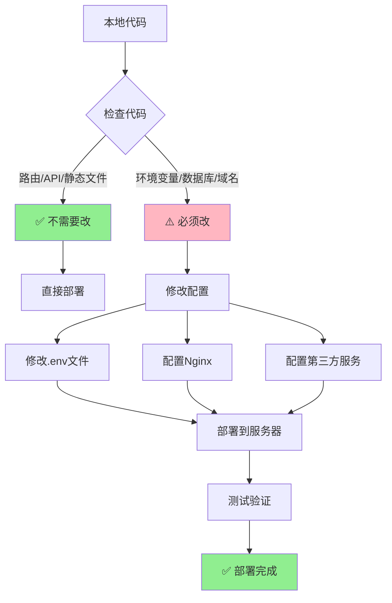

### 2. 配置变更决策树

```mermaid
graph TD
    A[开始部署] --> B{这是代码还是配置?}
    
    B -->|代码| C[路由定义<br/>@app.route]
    B -->|代码| D[前端API调用<br/>fetch/]
    B -->|代码| E[静态文件引用<br/>url_for]
    
    C --> F[✅ 不需要改]
    D --> F
    E --> F
    
    B -->|配置| G[环境变量<br/>.env文件]
    B -->|配置| H[数据库连接]
    B -->|配置| I[域名和URL]
    B -->|配置| J[Nginx配置]
    B -->|配置| K[第三方服务]
    
    G --> L[⚠️ 必须改]
    H --> L
    I --> L
    J --> L
    K --> L
    
    F --> M[直接部署]
    L --> N[修改后部署]
    
    style F fill:#90EE90
    style L fill:#FFB6C1
```

### 3. 配置变更详细流程

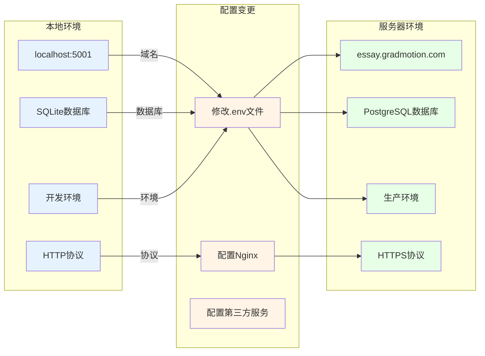

---

## 🔄 配置变更对比图

### 1. 代码层面（不需要改）

```mermaid
graph LR
    subgraph 本地代码
        A1[@app.route<br/>'/api/papers']
        A2[fetch<br/>'/api/papers']
        A3[url_for<br/>'static', ...]
    end
    
    subgraph 服务器代码
        B1[@app.route<br/>'/api/papers']
        B2[fetch<br/>'/api/papers']
        B3[url_for<br/>'static', ...]
    end
    
    A1 -.->|相同| B1
    A2 -.->|相同| B2
    A3 -.->|相同| B3
    
    style A1 fill:#90EE90
    style A2 fill:#90EE90
    style A3 fill:#90EE90
    style B1 fill:#90EE90
    style B2 fill:#90EE90
    style B3 fill:#90EE90
```

### 2. 配置层面（必须改）

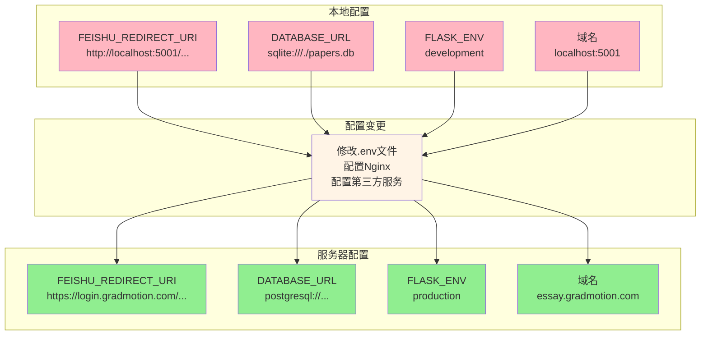

---

## 📋 配置变更清单（可视化）

### 1. 环境变量变更流程

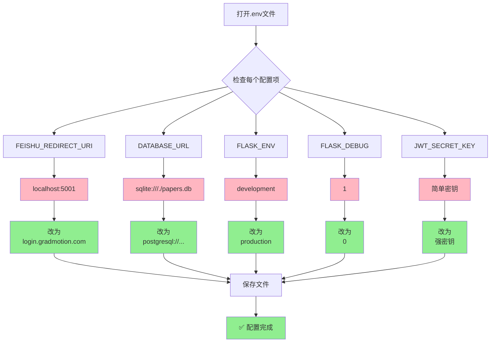

### 2. Nginx配置流程

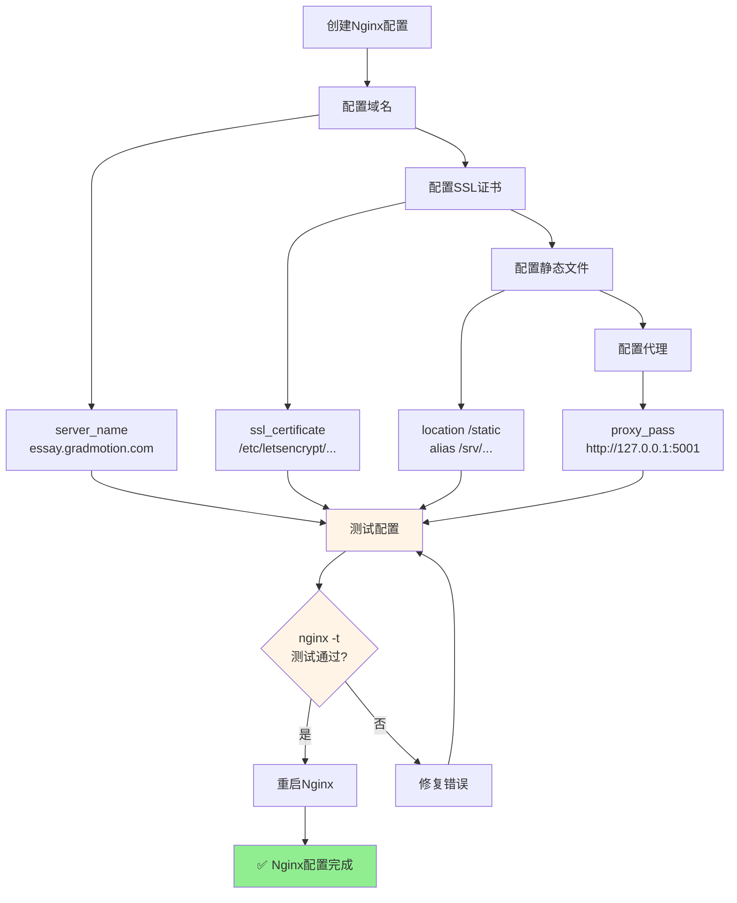

### 3. 第三方服务配置流程

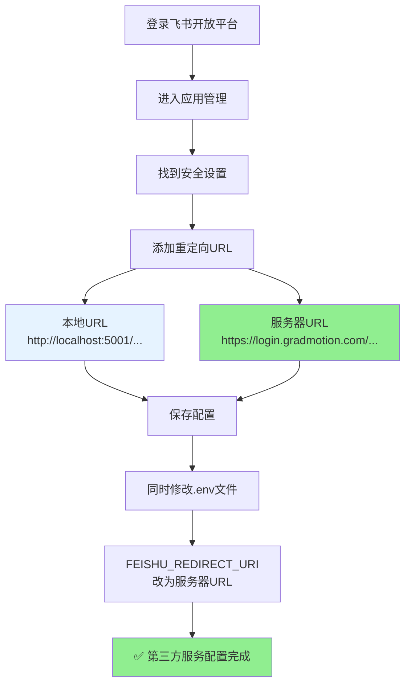

---

## 🎨 完整部署流程图

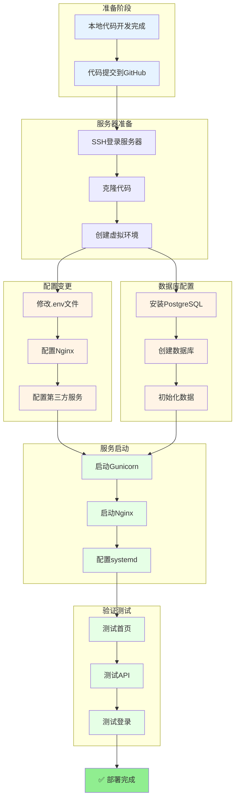

---

## 📊 配置变更对比表（可视化）

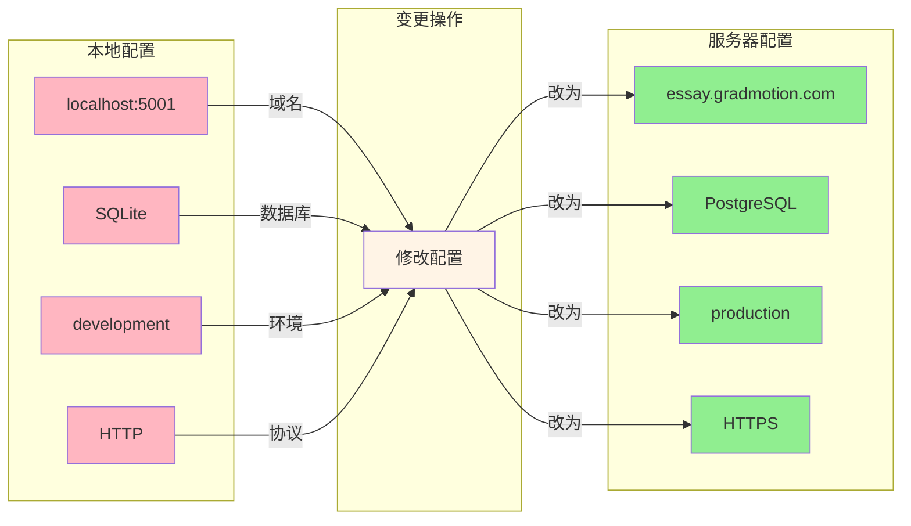

---

## 🎯 快速决策图

### 遇到配置项，如何判断？

```mermaid
graph TD
    A[遇到一个配置项] --> B{这是代码还是配置?}
    
    B -->|代码| C[路由定义<br/>@app.route]
    B -->|代码| D[API调用<br/>fetch/]
    B -->|代码| E[静态文件<br/>url_for]
    
    C --> F[✅ 不需要改]
    D --> F
    E --> F
    
    B -->|配置| G{配置类型}
    
    G -->|环境变量| H[.env文件]
    G -->|数据库| I[DATABASE_URL]
    G -->|域名| J[server_name]
    G -->|OAuth| K[回调URL]
    
    H --> L[⚠️ 必须改]
    I --> L
    J --> L
    K --> L
    
    F --> M[直接使用]
    L --> N[修改后使用]
    
    style F fill:#90EE90
    style L fill:#FFB6C1
    style M fill:#90EE90
    style N fill:#FFF4E6
```

---

## 📝 配置变更检查清单（可视化）

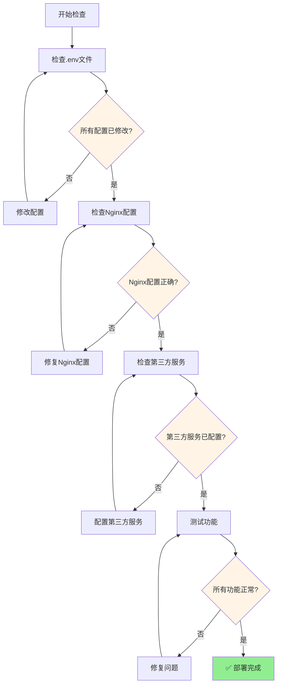

---

## 💡 核心要点总结

### 1. 代码 vs 配置

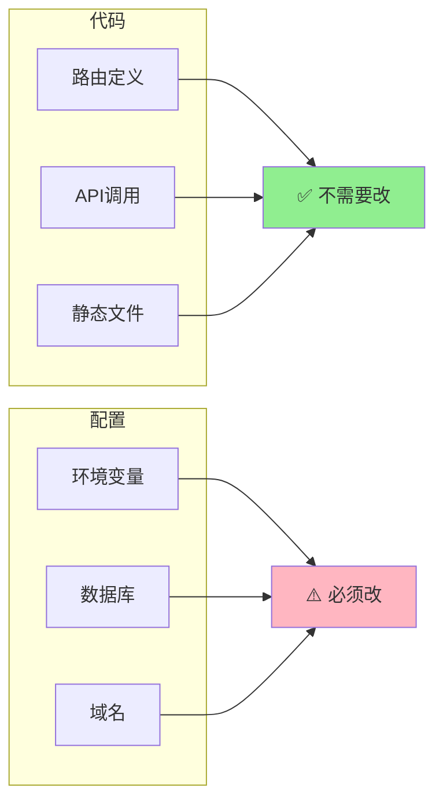

### 2. 必须修改的配置项

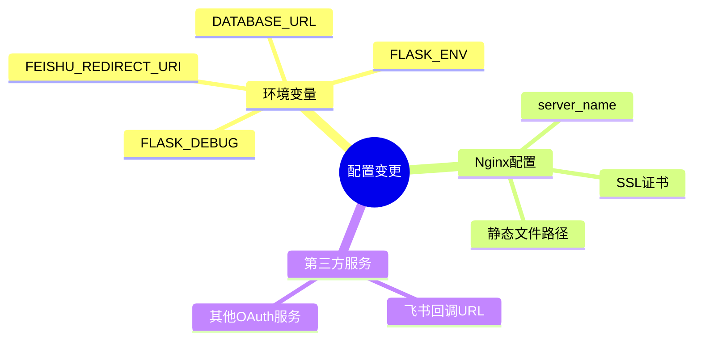

### 3. 不需要修改的代码

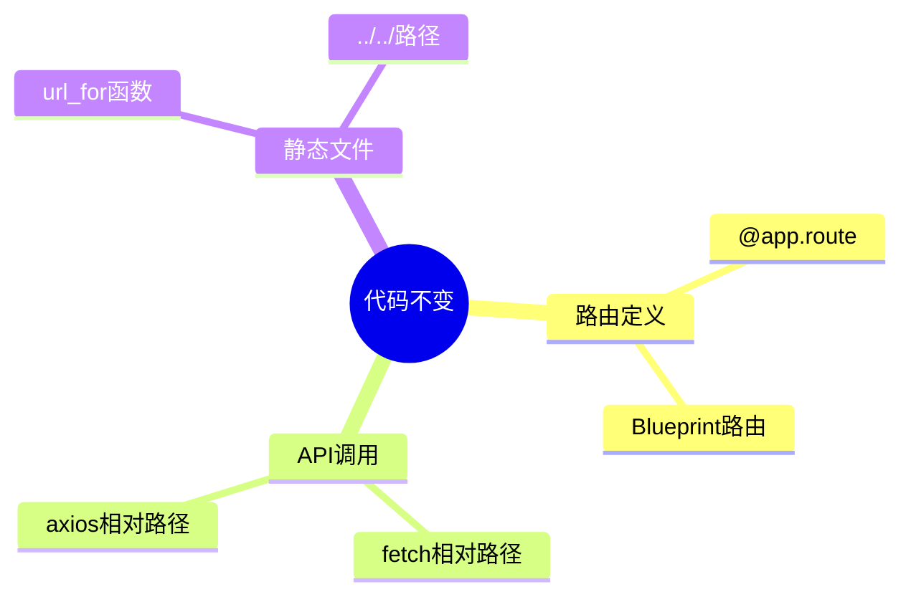

---

## 🚀 快速参考

### 配置变更速查表

| 类型 | 项目 | 本地 | 服务器 | 需要改？ |
|------|------|------|--------|---------|
| **代码** | 路由 | `/api/papers` | `/api/papers` | ❌ 不需要 |
| **代码** | API调用 | `fetch('/api/papers')` | `fetch('/api/papers')` | ❌ 不需要 |
| **配置** | OAuth回调 | `localhost:5001` | `login.gradmotion.com` | ✅ 必须改 |
| **配置** | 数据库 | `sqlite:///...` | `postgresql://...` | ✅ 必须改 |
| **配置** | 环境 | `development` | `production` | ✅ 必须改 |

---

## 📚 相关文档

- [本地到服务器配置变更完整指南](./本地到服务器配置变更完整指南_20251219_v1.0.md) - 详细说明文档
- [从0到1完整部署教程](./从0到1完整部署教程_20251217_v1.0.md) - 完整部署流程
- [环境部署教程](./环境部署教程_20251217_v1.0.md) - 环境配置详细步骤

---

**最后更新**：2025-12-19  
**维护者**：AI开发助手  
**版本**：v1.0

