# 从0到1全栈产品开发完整指南（可视化版）

**文档版本**: v2.0  
**创建日期**: 2025-12-19  
**最后更新**: 2025-12-19  
**基于项目**: Embodied Pulse 实际开发经验  
**目标读者**: 零基础小白，想从0开始做一个完整的全栈产品并上线  
**特点**: 使用Mermaid图表可视化整个开发流程

---

## 📋 目录

1. [整体流程概览](#整体流程概览)
2. [第一阶段：了解需求](#第一阶段了解需求)
3. [第二阶段：定义产品](#第二阶段定义产品)
4. [第三阶段：确认产品需求（PRD）](#第三阶段确认产品需求prd)
5. [第四阶段：制定技术规格（SPEC）](#第四阶段制定技术规格spec)
6. [第五阶段：开发实现](#第五阶段开发实现)
7. [第六阶段：迭代优化](#第六阶段迭代优化)
8. [第七阶段：第一次部署上线](#第七阶段第一次部署上线)
9. [第八阶段：部署迁移与运维](#第八阶段部署迁移与运维)
10. [系统架构图](#系统架构图)

---

## 整体流程概览

### 完整开发流程时序图

```mermaid
sequenceDiagram
    participant 你 as 开发者
    participant 需求 as 需求分析
    participant 产品 as 产品定义
    participant PRD as 产品需求文档
    participant SPEC as 技术规格文档
    participant 开发 as 开发实现
    participant 测试 as 测试验证
    participant 部署 as 部署上线
    participant 运维 as 运维监控

    你->>需求: 1. 发现痛点
    需求->>产品: 2. 定义产品定位
    产品->>PRD: 3. 写产品需求文档
    PRD->>SPEC: 4. 写技术规格文档
    SPEC->>开发: 5. 开始编码
    开发->>测试: 6. 本地测试
    测试->>部署: 7. 部署到服务器
    部署->>运维: 8. 监控运行
    运维->>你: 9. 收集反馈
    你->>开发: 10. 迭代优化
```

### 开发阶段关系图

```mermaid
graph TD
    A[1. 了解需求] --> B[2. 定义产品]
    B --> C[3. 确认产品需求 PRD]
    C --> D[4. 制定技术规格 SPEC]
    D --> E[5. 开发实现]
    E --> F[6. 迭代优化]
    F --> G[7. 第一次部署上线]
    G --> H[8. 部署迁移与运维]
    H --> F
    
    style A fill:#e1f5ff
    style B fill:#e1f5ff
    style C fill:#fff4e1
    style D fill:#fff4e1
    style E fill:#e8f5e9
    style F fill:#e8f5e9
    style G fill:#fce4ec
    style H fill:#fce4ec
```

---

## 第一阶段：了解需求

### 需求发现流程

```mermaid
flowchart TD
    A[开始] --> B{从哪里发现需求?}
    B -->|方法1| C[自己的痛点]
    B -->|方法2| D[用户反馈]
    B -->|方法3| E[市场机会]
    
    C --> F[记录痛点]
    D --> G[收集反馈]
    E --> H[分析市场]
    
    F --> I[验证痛点是否普遍]
    G --> I
    H --> I
    
    I -->|是| J[确定需求]
    I -->|否| K[放弃或调整]
    
    J --> L[分析需求优先级]
    L --> M[P0: 高价值+低难度]
    L --> N[P1: 高价值+高难度]
    L --> O[P2: 低价值+低难度]
    L --> P[P3: 低价值+高难度]
    
    M --> Q[立即做]
    N --> R[规划做]
    O --> S[有空做]
    P --> T[暂不做]
    
    style M fill:#4caf50
    style N fill:#ff9800
    style O fill:#2196f3
    style P fill:#f44336
```

### 需求分析框架（5W1H）

```mermaid
mindmap
  root((需求分析))
    Who 谁
      目标用户
      年龄职业
      技术能力
    What 什么
      核心需求
      期望功能
      使用场景
    Why 为什么
      解决什么问题
      创造什么价值
      为什么现在需要
    When 何时
      使用频率
      使用时间
      使用场景
    Where 哪里
      使用环境
      使用设备
      网络环境
    How 如何
      使用流程
      操作步骤
      交互方式
```

---

## 第二阶段：定义产品

### 产品定义流程

```mermaid
flowchart LR
    A[需求] --> B[产品定位]
    B --> C[一句话描述]
    B --> D[产品类型]
    B --> E[核心功能]
    
    A --> F[核心价值]
    F --> G[价值主张]
    F --> H[Top 3价值点]
    
    A --> I[目标用户]
    I --> J[用户画像]
    I --> K[使用场景]
    
    C --> L[产品定义文档]
    G --> L
    J --> L
    
    style B fill:#e1f5ff
    style F fill:#fff4e1
    style I fill:#e8f5e9
```

### 产品形态选择决策树

```mermaid
graph TD
    A[选择产品形态] --> B{主要使用设备?}
    B -->|电脑| C[Web应用]
    B -->|手机| D[移动应用]
    B -->|桌面| E[桌面应用]
    
    C --> C1[✅ 跨平台<br/>✅ 开发成本低<br/>✅ 易于部署<br/>❌ 依赖网络]
    
    D --> D1[✅ 用户体验好<br/>✅ 可离线使用<br/>❌ 开发成本高<br/>❌ 需要审核]
    
    E --> E1[✅ 性能最好<br/>❌ 开发成本高<br/>❌ 安装门槛高]
    
    style C fill:#4caf50
    style C1 fill:#c8e6c9
```

---

## 第三阶段：确认产品需求（PRD）

### PRD文档结构

```mermaid
graph TD
    A[PRD文档] --> B[1. 产品概述]
    A --> C[2. 用户分析]
    A --> D[3. 功能需求]
    A --> E[4. 非功能需求]
    A --> F[5. 用户场景]
    A --> G[6. 验收标准]
    
    B --> B1[产品定义<br/>产品价值<br/>产品定位]
    
    C --> C1[目标用户<br/>用户画像<br/>用户场景]
    
    D --> D1[核心功能 P0<br/>重要功能 P1<br/>可选功能 P2]
    
    E --> E1[性能要求<br/>安全要求<br/>可用性要求]
    
    F --> F1[主要场景<br/>次要场景<br/>异常场景]
    
    G --> G1[功能验收<br/>性能验收<br/>用户体验验收]
    
    style D1 fill:#4caf50
```

### 功能优先级矩阵

```mermaid
graph LR
    subgraph 优先级矩阵
        A[高价值] --> B[P0 立即做]
        A --> C[P1 规划做]
        D[低价值] --> E[P2 有空做]
        D --> F[P3 暂不做]
    end
    
    subgraph 难度
        G[低难度] --> B
        G --> E
        H[高难度] --> C
        H --> F
    end
    
    style B fill:#4caf50
    style C fill:#ff9800
    style E fill:#2196f3
    style F fill:#f44336
```

### 用户场景流程图

```mermaid
sequenceDiagram
    participant 用户 as 用户
    participant 浏览器 as 浏览器
    participant 服务器 as 服务器
    participant 数据库 as 数据库

    用户->>浏览器: 1. 打开网站
    浏览器->>服务器: 2. 请求首页
    服务器->>数据库: 3. 查询论文列表
    数据库-->>服务器: 4. 返回数据
    服务器-->>浏览器: 5. 返回HTML+数据
    浏览器-->>用户: 6. 显示页面
    
    用户->>浏览器: 7. 点击论文
    浏览器->>服务器: 8. 请求论文详情
    服务器->>数据库: 9. 查询论文详情
    数据库-->>服务器: 10. 返回详情
    服务器-->>浏览器: 11. 返回详情页面
    浏览器-->>用户: 12. 显示详情
```

---

## 第四阶段：制定技术规格（SPEC）

### 技术选型决策流程

```mermaid
flowchart TD
    A[技术选型] --> B{前端技术}
    A --> C{后端技术}
    A --> D{数据库技术}
    
    B --> B1{项目规模?}
    B1 -->|小项目| B2[原生JS]
    B1 -->|大项目| B3[React/Vue]
    
    C --> C1{团队熟悉?}
    C1 -->|Python| C2[Flask/Django]
    C1 -->|Java| C3[Spring]
    C1 -->|Node.js| C4[Express]
    
    D --> D1{数据规模?}
    D1 -->|小| D2[SQLite]
    D1 -->|大| D3[PostgreSQL/MySQL]
    
    style B2 fill:#4caf50
    style C2 fill:#4caf50
    style D2 fill:#ff9800
    style D3 fill:#4caf50
```

### 系统架构图

```mermaid
graph TB
    subgraph 前端层
        A[HTML]
        B[CSS]
        C[JavaScript]
    end
    
    subgraph 网络层
        D[Nginx<br/>反向代理]
    end
    
    subgraph 应用层
        E[Gunicorn<br/>WSGI服务器]
        F[Flask应用]
        G[定时任务<br/>APScheduler]
    end
    
    subgraph 数据层
        H[PostgreSQL<br/>数据库]
    end
    
    A --> D
    B --> D
    C --> D
    D --> E
    E --> F
    F --> G
    F --> H
    G --> H
    
    style A fill:#e3f2fd
    style B fill:#e3f2fd
    style C fill:#e3f2fd
    style D fill:#fff3e0
    style E fill:#f3e5f5
    style F fill:#f3e5f5
    style G fill:#f3e5f5
    style H fill:#e8f5e9
```

### 数据库设计流程

```mermaid
flowchart TD
    A[开始设计数据库] --> B[1. 识别实体]
    B --> C[论文 Paper]
    B --> D[用户 User]
    B --> E[视频 Video]
    
    C --> F[2. 定义属性]
    D --> F
    E --> F
    
    F --> G[标题 title<br/>作者 authors<br/>日期 date<br/>链接 url]
    
    G --> H[3. 定义关系]
    H --> I[一对一 1:1]
    H --> J[一对多 1:N]
    H --> K[多对多 N:N]
    
    I --> L[4. 设计表结构]
    J --> L
    K --> L
    
    L --> M[5. 创建索引]
    M --> N[6. 优化设计]
    N --> O[完成]
    
    style B fill:#e1f5ff
    style F fill:#fff4e1
    style H fill:#e8f5e9
    style L fill:#fce4ec
```

---

## 第五阶段：开发实现

### 开发环境搭建流程

```mermaid
sequenceDiagram
    participant 你 as 开发者
    participant 电脑 as 本地电脑
    participant Git as Git仓库
    participant 虚拟环境 as Python虚拟环境

    你->>电脑: 1. 安装Python/Git
    你->>电脑: 2. 创建项目目录
    你->>Git: 3. 初始化Git仓库
    Git-->>你: 4. 仓库创建成功
    你->>电脑: 5. 创建项目结构
    你->>虚拟环境: 6. 创建虚拟环境
    虚拟环境-->>你: 7. 虚拟环境就绪
    你->>虚拟环境: 8. 安装依赖包
    虚拟环境-->>你: 9. 依赖安装完成
    你->>电脑: 10. 开始编码
```

### 开发流程时序图

```mermaid
sequenceDiagram
    participant 你 as 开发者
    participant 代码 as 代码编辑器
    participant Git as Git
    participant 测试 as 本地测试
    participant GitHub as GitHub

    你->>代码: 1. 编写代码
    代码-->>你: 2. 代码完成
    你->>测试: 3. 本地测试
    测试-->>你: 4. 测试通过
    你->>Git: 5. git add .
    你->>Git: 6. git commit
    你->>GitHub: 7. git push
    GitHub-->>你: 8. 代码已推送
    
    Note over 你,GitHub: 重复步骤1-8直到功能完成
```

### 代码组织结构

```mermaid
graph TD
    A[项目根目录] --> B[app.py<br/>Flask主文件]
    A --> C[models.py<br/>数据库模型]
    A --> D[routes.py<br/>路由定义]
    A --> E[requirements.txt<br/>依赖列表]
    A --> F[templates/<br/>HTML模板]
    A --> G[static/<br/>静态资源]
    A --> H[scripts/<br/>脚本文件]
    A --> I[docs/<br/>文档]
    
    F --> F1[index.html]
    F --> F2[admin.html]
    
    G --> G1[css/<br/>样式文件]
    G --> G2[js/<br/>JavaScript文件]
    G --> G3[images/<br/>图片文件]
    
    style B fill:#e3f2fd
    style C fill:#fff3e0
    style D fill:#f3e5f5
    style F fill:#e8f5e9
    style G fill:#fce4ec
```

---

## 第六阶段：迭代优化

### 迭代流程

```mermaid
flowchart LR
    A[MVP v0.1] --> B[收集反馈]
    B --> C[确定优先级]
    C --> D[开发功能]
    D --> E[测试验证]
    E --> F[上线发布]
    F --> G[v0.2]
    G --> B
    
    style A fill:#4caf50
    style G fill:#2196f3
```

### MVP迭代路径

```mermaid
graph TD
    A[v0.1 MVP] --> A1[论文自动抓取]
    A --> A2[论文分类展示]
    A --> A3[搜索功能]
    
    A --> B[v0.2 功能扩展]
    B --> B1[Semantic Scholar]
    B --> B2[新闻功能]
    B --> B3[招聘信息]
    
    B --> C[v0.3 用户体验]
    C --> C1[UI优化]
    C --> C2[可视化图表]
    C --> C3[活跃作者排行]
    
    C --> D[v1.0 正式发布]
    D --> D1[用户认证]
    D --> D2[管理平台]
    D --> D3[B站视频Hub]
    
    style A fill:#4caf50
    style B fill:#ff9800
    style C fill:#2196f3
    style D fill:#9c27b0
```

### Bug修复流程

```mermaid
sequenceDiagram
    participant 用户 as 用户/监控
    participant 你 as 开发者
    participant 代码 as 代码
    participant 测试 as 测试环境
    participant 生产 as 生产环境

    用户->>你: 1. 发现问题
    你->>你: 2. 分析问题
    你->>代码: 3. 编写修复代码
    代码->>测试: 4. 本地测试
    测试-->>你: 5. 测试通过
    你->>生产: 6. 部署修复
    生产-->>用户: 7. 问题解决
```

---

## 第七阶段：第一次部署上线

### 部署前准备检查清单

```mermaid
graph TD
    A[部署前准备] --> B[代码检查]
    A --> C[文档检查]
    A --> D[数据检查]
    
    B --> B1[✅ 代码已提交GitHub]
    B --> B2[✅ 代码已测试]
    B --> B3[✅ 无调试代码]
    B --> B4[✅ 环境变量已配置]
    
    C --> C1[✅ README已更新]
    C --> C2[✅ 部署文档已准备]
    C --> C3[✅ 配置文件已准备]
    
    D --> D1[✅ 数据库迁移脚本]
    D --> D2[✅ 测试数据已准备]
    D --> D3[✅ 备份方案已准备]
    
    style B1 fill:#4caf50
    style B2 fill:#4caf50
    style B3 fill:#4caf50
    style B4 fill:#4caf50
```

### 服务器部署架构

```mermaid
graph TB
    subgraph 用户端
        A[用户浏览器]
    end
    
    subgraph 网络层
        B[Nginx<br/>反向代理<br/>端口80/443]
    end
    
    subgraph 应用层
        C[Gunicorn<br/>WSGI服务器<br/>端口5001]
        D[Flask应用]
        E[定时任务<br/>APScheduler]
    end
    
    subgraph 数据层
        F[PostgreSQL<br/>数据库<br/>端口5432]
    end
    
    A -->|HTTPS| B
    B -->|HTTP| C
    C --> D
    D --> E
    D --> F
    
    style A fill:#e3f2fd
    style B fill:#fff3e0
    style C fill:#f3e5f5
    style D fill:#f3e5f5
    style E fill:#f3e5f5
    style F fill:#e8f5e9
```

### 部署流程时序图

```mermaid
sequenceDiagram
    participant 你 as 开发者
    participant 服务器 as 服务器
    participant GitHub as GitHub
    participant Nginx as Nginx
    participant Gunicorn as Gunicorn
    participant 数据库 as PostgreSQL

    你->>服务器: 1. SSH连接服务器
    你->>服务器: 2. 安装基础工具<br/>Python/Git/Nginx/PostgreSQL
    你->>GitHub: 3. 克隆代码到服务器
    GitHub-->>服务器: 4. 代码下载完成
    你->>服务器: 5. 创建虚拟环境
    你->>服务器: 6. 安装依赖包
    你->>数据库: 7. 创建数据库和用户
    数据库-->>你: 8. 数据库创建成功
    你->>数据库: 9. 初始化表结构
    数据库-->>你: 10. 表结构创建成功
    你->>Gunicorn: 11. 配置systemd服务
    你->>Nginx: 12. 配置反向代理
    你->>Gunicorn: 13. 启动服务
    Gunicorn-->>你: 14. 服务运行中
    你->>Nginx: 15. 重启Nginx
    Nginx-->>你: 16. Nginx运行中
    你->>你: 17. 验证部署成功
```

### HTTPS配置流程

```mermaid
sequenceDiagram
    participant 你 as 开发者
    participant Certbot as Certbot
    participant LetEncrypt as Let's Encrypt
    participant Nginx as Nginx

    你->>Certbot: 1. 安装Certbot
    你->>Certbot: 2. 申请证书<br/>certbot --nginx -d domain.com
    Certbot->>LetEncrypt: 3. 验证域名
    LetEncrypt-->>Certbot: 4. 证书签发成功
    Certbot->>Nginx: 5. 自动配置HTTPS
    Nginx-->>你: 6. HTTPS配置完成
    Certbot->>Certbot: 7. 配置自动续期<br/>（cron任务）
```

---

## 第八阶段：部署迁移与运维

### 代码更新流程

```mermaid
sequenceDiagram
    participant 本地 as 本地开发
    participant GitHub as GitHub
    participant 服务器 as 服务器
    participant 服务 as 应用服务

    本地->>本地: 1. 修改代码
    本地->>本地: 2. 本地测试
    本地->>GitHub: 3. git push
    GitHub-->>本地: 4. 代码已推送
    
    本地->>服务器: 5. SSH连接服务器
    服务器->>GitHub: 6. git pull
    GitHub-->>服务器: 7. 拉取最新代码
    服务器->>服务器: 8. 更新依赖（如需要）
    服务器->>服务: 9. systemctl restart
    服务-->>服务器: 10. 服务重启成功
    服务器->>服务器: 11. 验证更新
```

### 数据库迁移流程（SQLite → PostgreSQL）

```mermaid
sequenceDiagram
    participant 你 as 开发者
    participant SQLite as SQLite数据库
    participant 备份 as 备份文件
    participant PostgreSQL as PostgreSQL数据库

    你->>SQLite: 1. 导出数据<br/>export_sqlite.py
    SQLite-->>备份: 2. 生成JSON备份文件
    备份-->>你: 3. 备份完成
    
    你->>PostgreSQL: 4. 创建新数据库
    PostgreSQL-->>你: 5. 数据库创建成功
    
    你->>PostgreSQL: 6. 初始化表结构<br/>init_db()
    PostgreSQL-->>你: 7. 表结构创建成功
    
    你->>备份: 8. 读取备份文件
    备份-->>你: 9. 数据加载完成
    你->>PostgreSQL: 10. 导入数据<br/>import_postgresql.py
    PostgreSQL-->>你: 11. 数据导入成功
    
    你->>你: 12. 验证数据完整性
```

### 监控与日志流程

```mermaid
graph LR
    A[应用运行] --> B[生成日志]
    B --> C[应用日志<br/>app.log]
    B --> D[Gunicorn日志<br/>access.log/error.log]
    B --> E[systemd日志<br/>journalctl]
    
    C --> F[日志分析]
    D --> F
    E --> F
    
    F --> G{发现问题?}
    G -->|是| H[排查问题]
    G -->|否| I[继续监控]
    
    H --> J[修复问题]
    J --> A
    
    style A fill:#e3f2fd
    style F fill:#fff3e0
    style H fill:#fce4ec
```

### 备份与恢复流程

```mermaid
sequenceDiagram
    participant 定时任务 as Cron定时任务
    participant 数据库 as PostgreSQL
    participant 备份目录 as 备份目录
    participant 你 as 开发者

    Note over 定时任务: 每天凌晨2点自动执行
    
    定时任务->>数据库: 1. pg_dump备份
    数据库-->>备份目录: 2. 生成备份文件<br/>db_backup_YYYYMMDD.sql
    备份目录->>备份目录: 3. 压缩备份文件<br/>.sql.gz
    备份目录->>备份目录: 4. 删除7天前的备份
    
    Note over 你: 需要恢复时
    
    你->>备份目录: 5. 选择备份文件
    备份目录-->>你: 6. 备份文件就绪
    你->>数据库: 7. 恢复数据<br/>psql < backup.sql
    数据库-->>你: 8. 数据恢复成功
```

### 故障排查决策树

```mermaid
graph TD
    A[发现问题] --> B{问题类型?}
    
    B -->|服务无法启动| C[检查systemd日志]
    B -->|502错误| D[检查Gunicorn服务]
    B -->|数据库连接失败| E[检查PostgreSQL]
    B -->|响应慢| F[检查性能]
    
    C --> C1[查看日志<br/>journalctl -u service]
    C1 --> C2{找到错误?}
    C2 -->|是| C3[修复错误]
    C2 -->|否| C4[检查配置文件]
    
    D --> D1[检查服务状态<br/>systemctl status]
    D1 --> D2{服务运行?}
    D2 -->|否| D3[重启服务]
    D2 -->|是| D4[检查Nginx配置]
    
    E --> E1[检查PostgreSQL状态]
    E1 --> E2{服务运行?}
    E2 -->|否| E3[启动PostgreSQL]
    E2 -->|是| E4[检查连接配置]
    
    F --> F1[检查数据库查询]
    F1 --> F2[检查索引]
    F2 --> F3[优化查询]
    
    C3 --> G[问题解决]
    D3 --> G
    D4 --> G
    E3 --> G
    E4 --> G
    F3 --> G
    
    style A fill:#f44336
    style G fill:#4caf50
```

---

## 系统架构图

### 完整系统架构（ER图风格）

```mermaid
graph TB
    subgraph 用户层
        U1[研究者]
        U2[管理员]
    end
    
    subgraph 前端层
        F1[HTML页面]
        F2[CSS样式]
        F3[JavaScript交互]
    end
    
    subgraph 网络层
        N1[Nginx<br/>反向代理<br/>HTTPS]
    end
    
    subgraph 应用层
        A1[Gunicorn<br/>WSGI服务器]
        A2[Flask应用]
        A3[API路由]
        A4[页面路由]
        A5[定时任务<br/>APScheduler]
    end
    
    subgraph 数据层
        D1[(PostgreSQL<br/>数据库)]
        D2[论文表<br/>papers]
        D3[用户表<br/>users]
        D4[视频表<br/>videos]
    end
    
    subgraph 外部服务
        E1[ArXiv API]
        E2[B站 API]
        E3[Semantic Scholar]
    end
    
    U1 --> F1
    U2 --> F1
    F1 --> N1
    F2 --> N1
    F3 --> N1
    N1 --> A1
    A1 --> A2
    A2 --> A3
    A2 --> A4
    A2 --> A5
    A3 --> D1
    A4 --> D1
    A5 --> D1
    D1 --> D2
    D1 --> D3
    D1 --> D4
    A5 --> E1
    A5 --> E2
    A5 --> E3
    
    style U1 fill:#e3f2fd
    style U2 fill:#e3f2fd
    style F1 fill:#fff3e0
    style F2 fill:#fff3e0
    style F3 fill:#fff3e0
    style N1 fill:#f3e5f5
    style A1 fill:#e8f5e9
    style A2 fill:#e8f5e9
    style D1 fill:#fce4ec
    style E1 fill:#fff9c4
    style E2 fill:#fff9c4
    style E3 fill:#fff9c4
```

### 数据流转图

```mermaid
sequenceDiagram
    participant 用户 as 用户
    participant 前端 as 前端页面
    participant API as Flask API
    participant 数据库 as PostgreSQL
    participant 外部 as 外部API

    Note over 用户,外部: 论文抓取流程
    
    定时任务->>外部: 1. 调用ArXiv API
    外部-->>定时任务: 2. 返回论文列表
    定时任务->>数据库: 3. 保存论文数据
    数据库-->>定时任务: 4. 保存成功
    
    Note over 用户,外部: 用户查看论文流程
    
    用户->>前端: 5. 打开网站
    前端->>API: 6. GET /api/papers
    API->>数据库: 7. 查询论文列表
    数据库-->>API: 8. 返回数据
    API-->>前端: 9. 返回JSON
    前端-->>用户: 10. 显示论文列表
    
    用户->>前端: 11. 点击论文
    前端->>API: 12. GET /api/papers/{id}
    API->>数据库: 13. 查询论文详情
    数据库-->>API: 14. 返回详情
    API-->>前端: 15. 返回详情页面
    前端-->>用户: 16. 显示论文详情
```

### 部署架构图

```mermaid
graph TB
    subgraph 开发环境
        DEV[本地电脑]
        DEV_GIT[Git仓库]
    end
    
    subgraph 代码仓库
        GITHUB[GitHub]
    end
    
    subgraph 生产环境
        SERVER[云服务器]
        NGINX[Nginx]
        GUNICORN[Gunicorn]
        FLASK[Flask应用]
        DB[(PostgreSQL)]
    end
    
    DEV -->|git push| DEV_GIT
    DEV_GIT -->|推送| GITHUB
    GITHUB -->|git pull| SERVER
    SERVER --> NGINX
    NGINX --> GUNICORN
    GUNICORN --> FLASK
    FLASK --> DB
    
    style DEV fill:#e3f2fd
    style GITHUB fill:#fff3e0
    style SERVER fill:#f3e5f5
    style DB fill:#e8f5e9
```

---

## 核心概念关系图

### 开发流程核心概念

```mermaid
mindmap
  root((全栈开发))
    需求阶段
      痛点分析
      用户画像
      需求优先级
    产品阶段
      产品定位
      核心价值
      目标用户
    设计阶段
      PRD文档
      SPEC文档
      数据库设计
    开发阶段
      前端开发
      后端开发
      数据库开发
    部署阶段
      服务器配置
      服务部署
      HTTPS配置
    运维阶段
      监控日志
      备份恢复
      故障排查
```

### 技术栈关系图

```mermaid
graph LR
    subgraph 前端技术
        A1[HTML]
        A2[CSS]
        A3[JavaScript]
    end
    
    subgraph 后端技术
        B1[Flask]
        B2[Python]
        B3[SQLAlchemy]
    end
    
    subgraph 数据库
        C1[PostgreSQL]
    end
    
    subgraph 部署技术
        D1[Nginx]
        D2[Gunicorn]
        D3[systemd]
    end
    
    A1 --> B1
    A2 --> B1
    A3 --> B1
    B1 --> B2
    B1 --> B3
    B3 --> C1
    B1 --> D2
    D1 --> D2
    D2 --> D3
    
    style A1 fill:#e3f2fd
    style A2 fill:#e3f2fd
    style A3 fill:#e3f2fd
    style B1 fill:#fff3e0
    style B2 fill:#fff3e0
    style B3 fill:#fff3e0
    style C1 fill:#e8f5e9
    style D1 fill:#f3e5f5
    style D2 fill:#f3e5f5
    style D3 fill:#f3e5f5
```

---

## 快速参考：关键流程图

### 完整开发到上线流程

```mermaid
flowchart TD
    Start([开始]) --> 需求[1. 了解需求]
    需求 --> 产品[2. 定义产品]
    产品 --> PRD[3. 写PRD文档]
    PRD --> SPEC[4. 写SPEC文档]
    SPEC --> 开发[5. 开发实现]
    开发 --> 测试{测试通过?}
    测试 -->|否| 开发
    测试 -->|是| 迭代[6. 迭代优化]
    迭代 --> 部署[7. 部署上线]
    部署 --> 运维[8. 运维监控]
    运维 --> 反馈{有反馈?}
    反馈 -->|是| 迭代
    反馈 -->|否| End([持续运行])
    
    style Start fill:#4caf50
    style End fill:#4caf50
    style 测试 fill:#ff9800
    style 反馈 fill:#ff9800
```

### 日常开发工作流

```mermaid
sequenceDiagram
    participant 你 as 开发者
    participant 代码 as 代码
    participant Git as Git
    participant GitHub as GitHub
    participant 服务器 as 服务器

    loop 每天开发
        你->>代码: 1. 编写代码
        代码-->>你: 2. 完成功能
        你->>代码: 3. 本地测试
        代码-->>你: 4. 测试通过
        你->>Git: 5. git add .
        你->>Git: 6. git commit
        你->>GitHub: 7. git push
        GitHub-->>你: 8. 代码已推送
    end
    
    Note over 你,服务器: 需要部署时
    
    你->>服务器: 9. SSH连接
    服务器->>GitHub: 10. git pull
    GitHub-->>服务器: 11. 拉取代码
    服务器->>服务器: 12. 重启服务
    服务器-->>你: 13. 部署完成
```

---

## 总结

### 核心流程一句话总结

```
需求 → 产品 → PRD → SPEC → 开发 → 测试 → 部署 → 运维 → 迭代
```

### 关键成功因素

```mermaid
graph LR
    A[成功因素] --> B[MVP优先]
    A --> C[小步快跑]
    A --> D[用户第一]
    A --> E[文档同步]
    A --> F[持续优化]
    
    style B fill:#4caf50
    style C fill:#4caf50
    style D fill:#4caf50
    style E fill:#4caf50
    style F fill:#4caf50
```

### 学习路径建议

```mermaid
graph TD
    A[零基础小白] --> B[第1周: 学习基础]
    B --> B1[Python基础]
    B --> B2[HTML/CSS/JS基础]
    B --> B3[Git基础]
    
    B --> C[第2-3周: 学习框架]
    C --> C1[Flask框架]
    C --> C2[SQLAlchemy ORM]
    C --> C3[数据库基础]
    
    C --> D[第4周: 实战项目]
    D --> D1[跟着指南做项目]
    D --> D2[遇到问题查文档]
    D --> D3[完成MVP版本]
    
    D --> E[第5-6周: 部署上线]
    E --> E1[学习服务器操作]
    E --> E2[学习Nginx配置]
    E --> E3[完成第一次部署]
    
    style A fill:#e3f2fd
    style D fill:#4caf50
    style E fill:#ff9800
```

---

**最后更新**：2025-12-19  
**维护者**：AI开发助手  
**版本**：v2.0（可视化版）

**说明**：本文档使用Mermaid图表可视化整个开发流程，适合零基础小白理解。建议配合原版文字文档一起阅读，图表帮助理解流程，文字提供详细说明。

